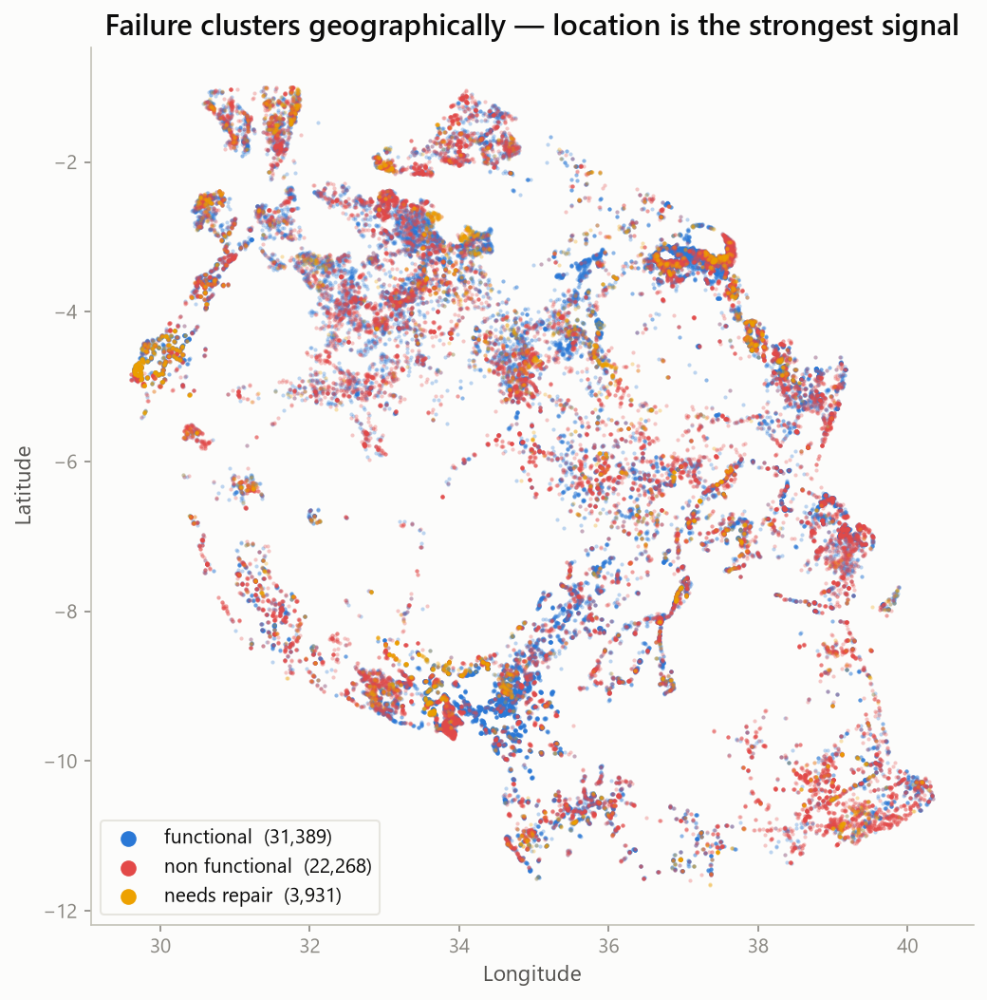
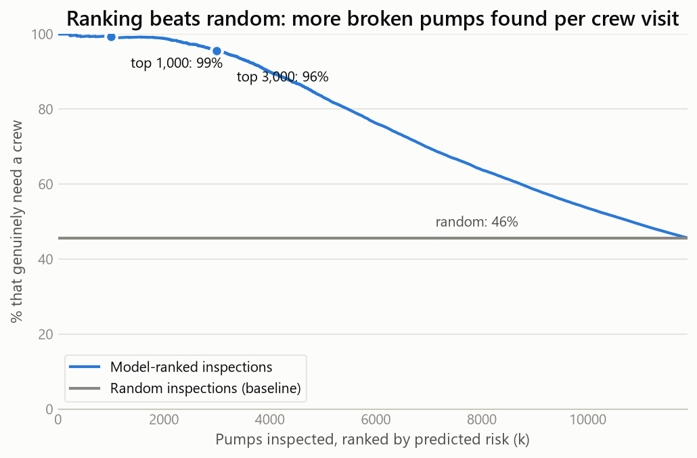
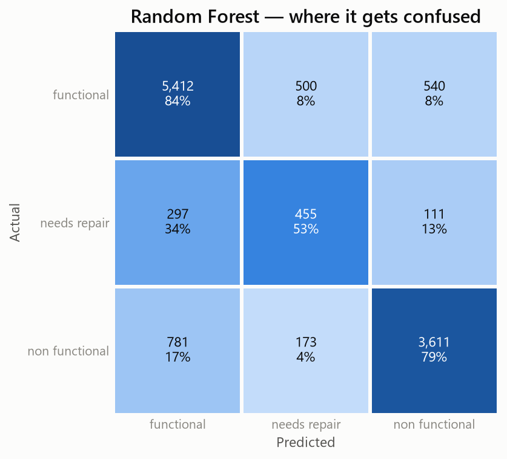
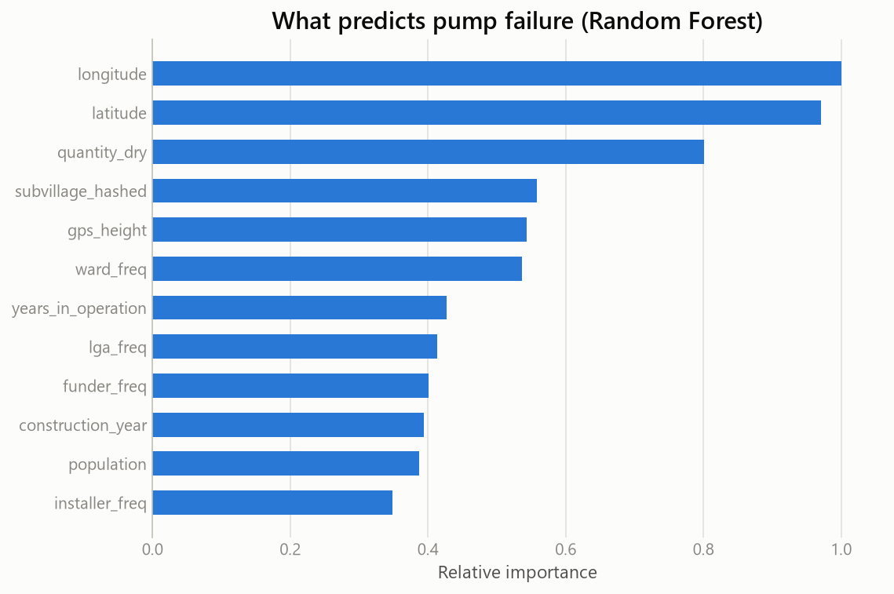
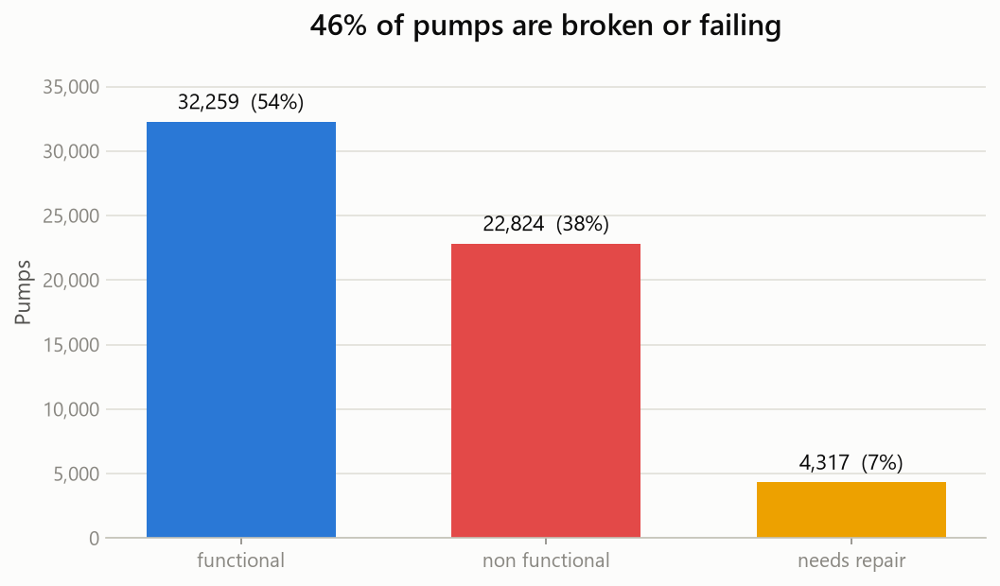
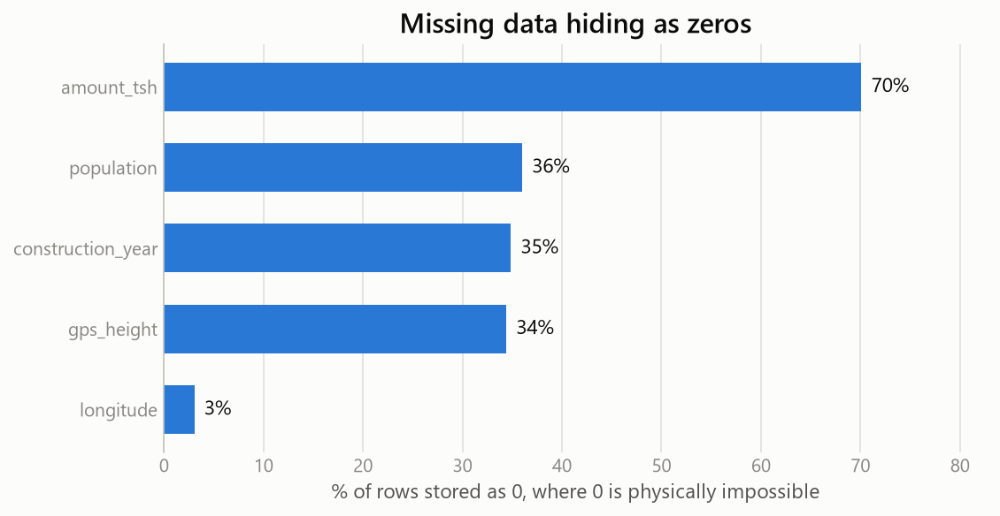

# Tanzania Water Pump Failures — Predicting & Prioritizing Repairs

[](https://github.com/Genesishg1509/tanzania-water-pump-failures/actions/workflows/ci.yml)
[](https://www.python.org/)
[](LICENSE)

Tanzania has ~59,000 rural water points, and **46% of them are broken or
failing**. Repair crews are limited, so the real question is not "which pumps
are broken?" but **"which pumps should we drive to first?"**

This project answers that end-to-end: a leak-free ML pipeline that predicts pump
status, plus a decision layer that turns those predictions into an inspection
schedule a water authority could actually run.



Data: the [DrivenData "Pump it Up"](https://www.drivendata.org/competitions/7/pump-it-up-data-mining-the-water-table/)
competition — 59,400 labeled pumps, 40 features, 3 classes.

---

## The result that matters

A model that reports 80% accuracy sounds good and tells you nothing about
whether it is *useful*. Two questions decide that.

### 1. If crews can only inspect k pumps, how well is that budget spent?

Ranking pumps by predicted risk — `P(non functional) + P(needs repair)` — and
sending crews down that list:



| Inspections (k) | Genuinely need a crew | Share of all broken pumps found | Lift vs. random |
|---:|:---:|:---:|:---:|
| 500 | **99.4%** | 9.2% | 2.18× |
| 1,000 | **99.3%** | 18.3% | 2.17× |
| 2,500 | 97.3% | 44.8% | 2.13× |
| 5,000 | 83.2% | 76.7% | 1.82× |

**Read this as:** send crews to the top 1,000 ranked pumps and **993 of them
genuinely need work**. Inspect 1,000 pumps at random and you find ~457. The
ranking more than doubles the return on every crew-day.

### 2. Are we optimizing for the right mistake?

`argmax P(class)` silently assumes every error costs the same. It doesn't:
leaving a broken pump unvisited strands a village for months, while a wasted
inspection costs one crew-day. Pricing that asymmetry (10:1 for a missed
failure, [documented in `src/decision.py`](src/decision.py)) and choosing the
**minimum-expected-cost** action instead:

| Decision rule | Accuracy | Missed broken pumps | Wasted visits | Total cost |
|---|:---:|:---:|:---:|:---:|
| `argmax P(class)` | **0.80** | 1,078 | 1,040 | 10,619 |
| min expected cost | 0.50 | **47** | 4,884 | **5,750** |

Same model, same probabilities — only the decision rule changes. Missed
failures fall **96%** (1,078 → 47), 24% more broken pumps get found, and total
cost drops **46%** — while accuracy *falls* from 0.80 to 0.50.

That is not a bug; it is the headline. Accuracy is the wrong objective for this
problem, and optimizing it would have quietly left a thousand villages without
water.

---

## Model performance

Stratified 20% hold-out. `needs repair` is the rare (7%), high-value minority
class and by far the hardest to predict.

| Model | Accuracy | Macro F1 | F1 (needs repair) | ROC AUC (OVR) |
|-------|:--------:|:--------:|:-----------------:|:-------------:|
| **Random Forest** | **0.798** | **0.704** | 0.457 | **0.904** |
| LightGBM | 0.787 | 0.699 | **0.460** | 0.902 |

<p align="center">
  
  
</p>

The model separates `functional` from `non functional` well (84% / 79% recall).
`needs repair` remains hard — it is rare and genuinely looks like both
neighbours, which is exactly why the ranking view above matters more than the
raw label.

---

## The data leak this project exists to fix

> The original university version of this analysis computed its encoding
> statistics over training, validation **and competition** data concatenated
> together. Every reported score was inflated, and nothing about the code looked
> wrong — it ran fine, the metrics just quietly lied.

Three defects were removed:

1. **Leaked encoders** — a `pd.concat([train, test, comp])` used to pick the top
   funders. (Its output was never even used downstream: dead code *and* a leak.)
2. **An unjustified `log1p`** applied to every numeric column — including
   `latitude`/`longitude` via `.abs()`, which corrupts Tanzania's
   all-negative latitudes. Tree ensembles are invariant to monotonic transforms,
   so it bought nothing and broke the geography.
3. **A mis-applied SMOTE step** running *after* one-hot encoding, synthesizing
   fractional values like `0.37` inside binary dummy columns and interpolating
   nominal hash-bucket ids — while `class_weight` corrected the same imbalance a
   second time.

After removing all three, the honest model scores **higher** on the hardest
class than the leaky one did.

**This is enforced by tests, not by good intentions.** `tests/test_no_leakage.py`
asserts that transforming a row never depends on its neighbours — if anyone
reintroduces a statistic fitted at transform time, CI goes red:

```python
def test_transform_is_row_independent(raw_train, raw_val):
    fe = FeatureEngineer().fit(raw_train)
    alone  = fe.transform(raw_val)
    padded = fe.transform(pd.concat([raw_val, make_raw(n=300, seed=7)]))
    pd.testing.assert_frame_equal(alone, padded.iloc[:len(raw_val)])
```

---

## What the raw data looks like

<p align="center">
  
  
</p>

The second chart is the trap: 70% of `amount_tsh` and 35% of `construction_year`
are stored as **`0`, not as blanks** — and zero is physically impossible for
both. Treated as real numbers they drag every statistic toward zero. They are
imputed from **train-only** medians, modes, and per-region conditional medians.

---

## Quickstart

```bash
pip install -r requirements.txt

# Place the two CSVs in data/raw/ (from the DrivenData competition page):
#   training_merged.csv           X_train merged with y_train on `id`
#   test_set_values_x_test.csv    competition set, no labels

python -m src.run_pipeline --save-model --metrics-json   # train, evaluate, submit
python -m src.figures                                    # regenerate README figures
python -m pytest                                         # 19 tests, no data needed
```

The test suite builds synthetic frames, so **CI verifies the leak-free contract
without the private competition data**.

---

## Project structure

```
├── .github/workflows/ci.yml   # tests on Python 3.10 / 3.11 / 3.12
├── data/raw/                  # DrivenData CSVs (not versioned)
├── notebooks/
│   ├── 01_tanzania_water_pumps.ipynb    # the narrative walkthrough
│   └── archive/                         # the original university notebook
├── reports/figures/           # the figures embedded above
├── src/
│   ├── config.py              # paths, column groups, constants
│   ├── data.py                # loading + target encoding
│   ├── features.py            # leak-free feature engineering (fit on train only)
│   ├── model.py               # Random Forest & LightGBM + evaluation
│   ├── decision.py            # risk ranking + cost-sensitive decisions
│   ├── figures.py             # regenerates every figure in this README
│   └── run_pipeline.py        # end-to-end CLI
└── tests/                     # incl. the leak regression suite
```

## Method

1. **Cleaning** — text normalization; zeros that actually mean "missing"
   (`amount_tsh`, `construction_year`, `district_code`, `longitude`) imputed from
   **train-only** statistics.
2. **Feature engineering** — `years_in_operation` from record vs. construction
   year; `scheme_name` → has-a-scheme flag.
3. **Encoding by cardinality** — feature hashing for `subvillage` (~19k levels),
   frequency encoding for `ward`/`lga`/`funder`/`installer`, one-hot for the
   rest, redundant hierarchy duplicates dropped. 136 features out.
4. **Imbalance** — per-class weighting, not SMOTE (cleaner for tree ensembles and
   it never synthesizes fractional values inside binary columns).
5. **Models** — Random Forest and LightGBM with early stopping.
6. **Decisions** — risk ranking + expected-cost minimization on top of the
   probabilities.

> **A note on the charts.** The three pump states look like a natural fit for a
> green/amber/red status palette, but simulated deuteranopia puts green and red
> at OKLab ΔE 4.1 — below the ΔE 6 legibility floor — and this data is drawn as a
> scatter map where every class touches every other. The blue/amber/red palette
> used here was picked by running the pairwise colour-vision check rather than by
> eye; it separates at ΔE 15.3.

## Roadmap

- [ ] Hyper-parameter search with Optuna + stratified cross-validation
- [ ] Calibrate the cost matrix against real field costs instead of assumed ratios
- [ ] Interactive risk map (folium) and a Streamlit app for field teams
- [ ] Spatial cross-validation — pumps cluster geographically, so a random split
      likely flatters every model here, this one included

## License

MIT — see [LICENSE](LICENSE).
